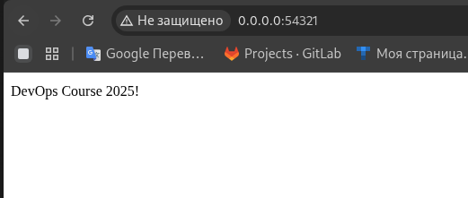

# Лабораторная работа №7  

## Выполнена в рамках прохождения обучения по курсу DevOps СИТУ  

Результат выполнения скрипта по поднятию контейнера nginx в браузере  

Результат выполнения скрипта по пересозданию сертификатов и пробрасыванию в контейнер
